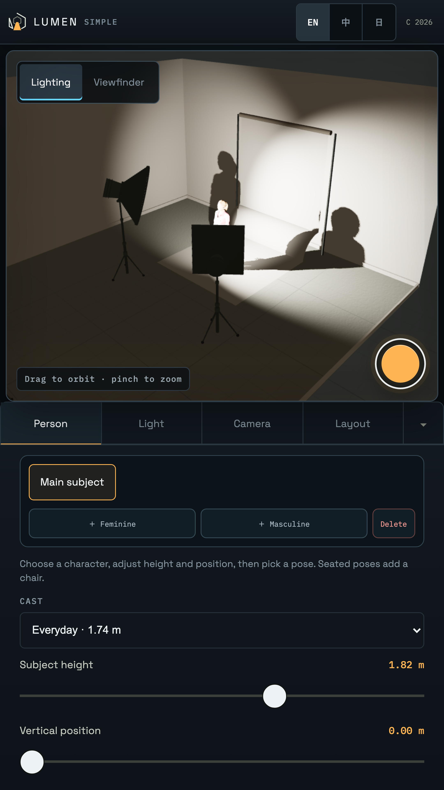

# Lumen Stage · v1

**Plan the light. Frame the shot.**

A browser-based virtual photography studio for arranging people, lights, cameras and backdrops before a real shoot.

**First release** · Free to use · Desktop and mobile · English / 繁體中文 / 日本語

[Open Lumen Stage](https://lumen-stage.vercel.app/) · [繁體中文介紹](README.zh-TW.md)

## From an idea to a shoot plan

1. **Choose a starting point.** Load one of 15 lighting setups, including Rembrandt, three-point and clamshell lighting.
2. **Choose your subject.** Browse the studio's 17 character options, then adjust position, height and pose.
3. **Arrange the light.** Work with distance, direction, output, colour temperature and light modifiers.
4. **Frame the photograph.** Adjust focal length, aperture and ISO; check the viewfinder before rendering.
5. **Take the plan with you.** Save the scene, export the project or prepare a lighting setup sheet.

## A scene you can work in

### Position people and lights

The subject, lights, camera and backdrop occupy the same measurable space. In Layout view, drag unlocked objects directly in the viewport, including with touch. Use the numeric controls when you need a precise position.

### Check the layout from above

Switch between studio, top-down plan, viewfinder and render views while keeping the same scene. The plan view makes spacing and lighting direction easier to inspect.

### Confirm framing and exposure

Check focal length, aperture, ISO and framing in Simple mode, or use the fuller camera controls in Professional mode. Higher-quality rendering is also available; rendering speed depends on the device and scene.

These are screenshots of a virtual studio, not photographs from a physical shoot. The simulation helps compare decisions; final exposure and colour still need to be checked on set.

## Choose the person in front of the lens

The homepage presents a large character preview alongside a selector for all 17 v1 options. The previews have transparent backgrounds and come from the studio's original 3D models.

  
  

Select another character to change the available build, face and clothing. Clothing and colour are baked into these characters' textures; selecting a different outfit is not the same as freely recolouring or reshaping a person.

## Two ways to work

| | Simple mode | Professional mode |
| --- | --- | --- |
| Best for | Getting started, quick adjustments and mobile use | Detailed planning and control |
| Workspace | Essential Person, Light, Camera and Layout controls | Full inspectors, metering, continuity, presets and export tools |
| Scene | Shared project format | Shared project format |

[Open Simple mode](https://lumen-stage.vercel.app/studio?ui=mobile) · [Open Professional mode](https://lumen-stage.vercel.app/studio?ui=full)

## Mobile, with room to work

The phone studio uses brighter editing views while keeping camera exposure separate. Choose an actual character instead of controls that cannot change baked-in clothing or physique. Selecting a seated pose adds a chair if there is no seat already in place.

In **Layout**, choose **Compact controls · hide presets** to give the scene more space while keeping object selection and position controls available. Show presets again whenever you need a new starting setup.

All updated interface screenshots are captured at **3840 × 2160** on desktop and **2160 × 3840** on phone. Open an image to view its full resolution.

## Feedback

[Leave feedback for YuYing](https://github.com/clark970417-eng/lumen-stage-showcase/issues/new?template=feedback.yml) — suggestions, bugs and general impressions are welcome in English, 繁體中文 or 日本語. GitHub sign-in is required and reports are public. Please leave private photos and project files out of reports.

[View submitted feedback](https://github.com/clark970417-eng/lumen-stage-showcase/issues)

## Included in the first release

- One navigation bar ordered to match the page, with a compact mobile menu.
- Scene images paired with clear, labelled settings previews.
- A selectable cast with larger transparent character previews.
- Task-specific illustrated onboarding and direct viewport dragging in Layout.
- Shared model loading and visible loading feedback for studio characters.
- English, Traditional Chinese and Japanese interfaces.
- An explicit **v1 · First release** marker in the About dialog.

## Your projects and data

Projects stay in the browser by default. There is no account requirement or behavioural analytics. Anonymous technical error reports may be sent, without scenes, photos, project names or imported files.

Export important projects as a backup. A scene-sharing link carries the scene data in its URL, so share it only with people you intend to give access to.

[Privacy](https://lumen-stage.vercel.app/privacy) · [Support and feedback](https://lumen-stage.vercel.app/support)

## About this repository

This repository contains product documentation and selected visuals. Application source code and development history are maintained separately.

The v1 visuals show the released interface and its studio assets. Homepage settings previews explain the controls; they are not interactive Studio inspectors. Character assets derive from [Microsoft Rocketbox](https://github.com/microsoft/Microsoft-Rocketbox), distributed under the MIT licence.

---

© 2026 YuYing · Lumen Stage
