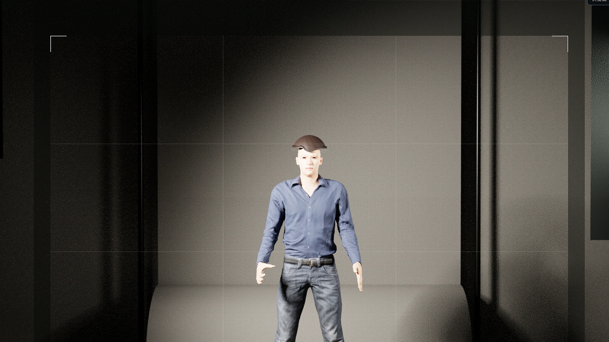

# Lumen Stage

**Plan the light. Frame the shot.**

Lumen Stage is a browser-based virtual photography studio for planning lighting, camera, subject, and backdrop decisions before a real shoot.

[Open the live website](https://lumen-stage.vercel.app/)

## What it helps you plan

- Build a scene with subjects, lights, cameras, and backdrops in one shared 3D space.
- Work with photographic controls such as distance, focal length, aperture, illuminance, colour temperature, and modifiers.
- Review the studio, camera frame, rendered result, and top-down layout without rebuilding the setup.
- Start from 15 classic lighting setups, including Rembrandt, three-point, and clamshell lighting.
- Save projects locally, compare decisions, and export a setup for use on set.

## Two workspace modes

**Simple mode** keeps the essential controls visible for first-time users and photography learners.

**Professional mode** provides the complete lighting, camera, metering, continuity, preset, and export workflow.

Both modes use the same scene format, so a project can move between them without being rebuilt.

## A continuous photography workflow

### Arrange the scene

Position the subject, build the lighting pattern, and adjust the scene with measurable spatial controls.

### Confirm the layout

Review the relationship between the subject, lights, camera, and backdrop from above before going on set.

### Review the result

Compare the live workspace with a higher-quality render to judge exposure, shadow direction, and detail.

## Availability

- Public beta
- Free to use
- No installation required
- No account or credit card required
- English, Traditional Chinese, and Japanese interfaces
- Desktop and mobile workspaces

## Privacy

Projects stay in the browser by default. Lumen Stage does not require an account and does not use project scenes as a public dataset.

## Repository access

This repository is a private product showcase. It contains product information and selected visuals only. The application source code and development history are maintained separately and are not included here.

---

© 2026 YuYing · Lumen Stage
