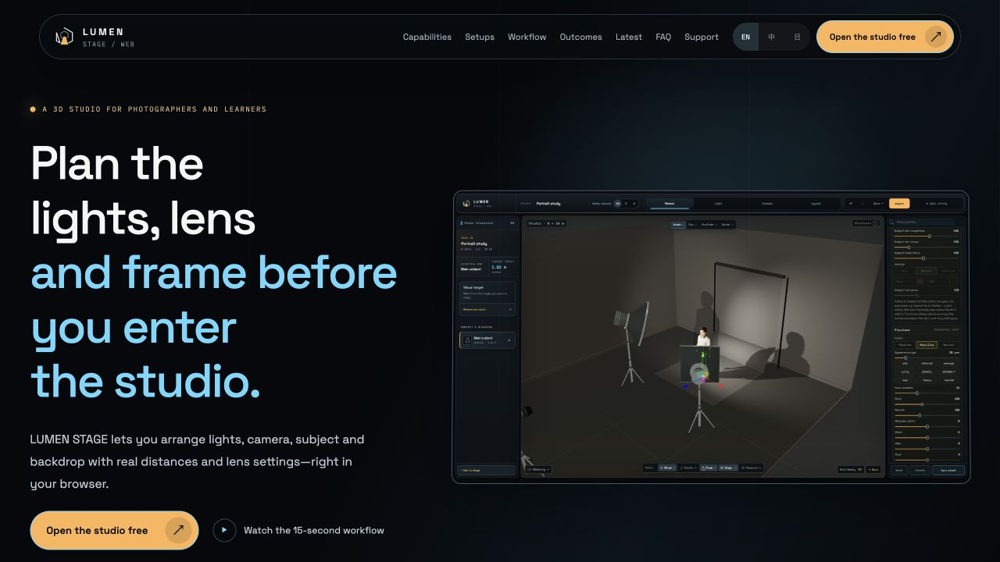
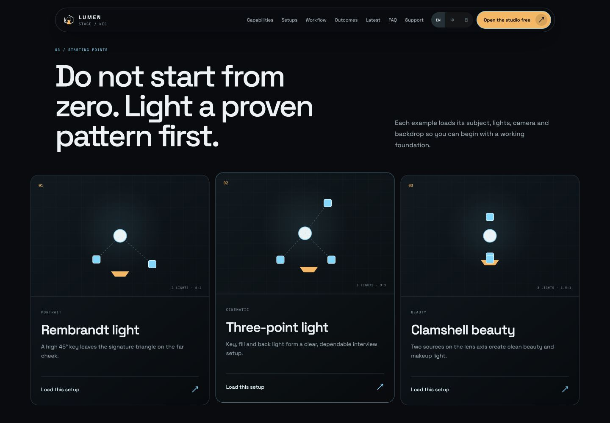
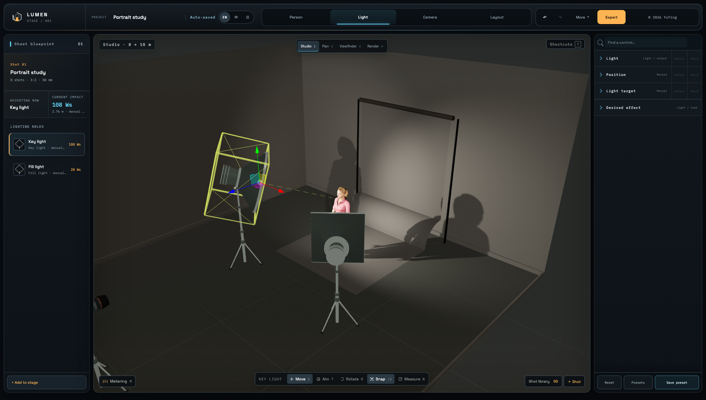
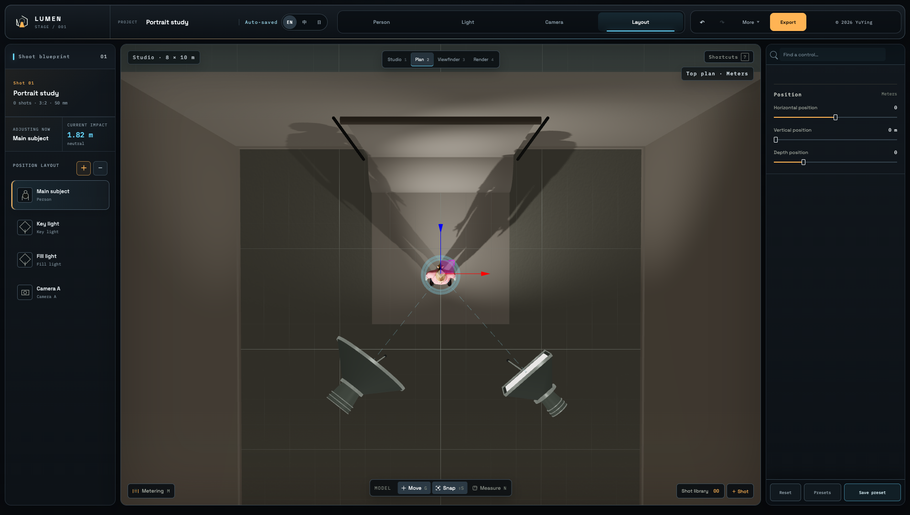
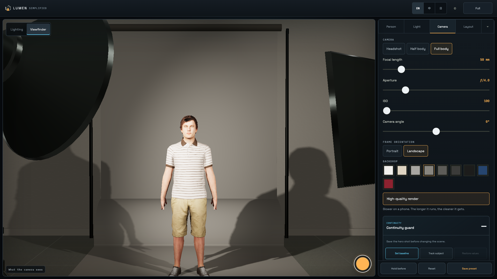

# Lumen Stage · v1 第一版

**進棚拍攝前，先排好燈位，再決定畫面。**

Lumen Stage 是在瀏覽器中使用的虛擬攝影棚。把人物、燈具、相機與背景放進同一個空間，預演下一次拍攝。

**第一版已發布** · 免費使用 · 支援桌機與手機 · 繁體中文 / English / 日本語

[開啟正式網站](https://lumen-stage.vercel.app/) · [English](README.md)

## 從想法到拍攝方案

1. **選擇起點：**從 15 組燈位配置開始，包括林布蘭光、三點布光與蚌殼光。
2. **選好主角：**瀏覽第一版的 12 個人物選項，再調整位置、身高與姿勢。
3. **安排燈光：**調整距離、方向、輸出功率、色溫與塑光附件。
4. **確認取景：**調整焦段、光圈與 ISO，確認鏡頭畫面後再算圖。
5. **帶到現場：**儲存場景、匯出專案，或準備燈位工作表。

## 在同一個場景裡完成規劃

### 安排人物與燈具

在 Layout／配置檢視中，可以直接拖曳畫面內未鎖定的物件，手機也能用觸控移動。需要精確定位時，再使用數值控制。

### 從上方確認位置

棚內、俯視、取景與成像檢視共用同一個場景，不必重新建立配置。從上方檢查間距與燈光方向，再回到鏡頭畫面確認構圖。

### 檢查取景與曝光

簡易模式保留核心相機控制，專業模式提供更完整的調整。也能使用高畫質算圖；算圖速度會依裝置與場景而不同。

這些是虛擬攝影棚截圖，不是現場實拍照片。模擬用於比較拍攝決策，正式曝光與顏色仍需在現場確認。

## 選擇鏡頭前的人物

首頁以一張大幅人物預覽搭配選單，呈現第一版的 12 個人物選項。主圖與縮圖使用原始 3D 模型輸出的透明背景素材。

  
  

不同人物提供不同的體型、臉部與服裝。這批人物的衣服與顏色已包含在貼圖中，因此更換人物不等於可以任意替同一個人改色或塑形。

## 兩種工作方式

| | 簡易模式 | 專業模式 |
| --- | --- | --- |
| 適合 | 入門、快速調整與手機操作 | 細部規劃與精確控制 |
| 介面 | 人物、佈光、相機、配置的核心操作 | 完整設定、測光、光線連戲、預設與匯出工具 |
| 專案 | 共用場景格式 | 共用場景格式 |

[開啟簡易模式](https://lumen-stage.vercel.app/studio?ui=mobile) · [開啟專業模式](https://lumen-stage.vercel.app/studio?ui=full)

## 第一版包含

- 與頁面順序一致的單一導覽列，以及手機選單。
- 左側場景搭配右側清晰設定預覽的功能展示。
- 可切換的大幅人物預覽與透明背景素材。
- 對應各操作的入門示意，以及 Layout 畫面內直接拖曳。
- 人物模型共用載入與可見的載入提示。
- 繁體中文、英文與日文介面。
- 關於視窗底部的 **v1 · 第一版** 標示。

## 專案與資料

專案預設保存在瀏覽器中，不需要帳號，也沒有行為分析。系統可能送出匿名技術錯誤回報，但不包含場景、照片、專案名稱或匯入檔案。

重要專案請匯出備份。場景分享連結會將場景資料放在網址中，請只分享給你希望授權查看的人。

[隱私說明](https://lumen-stage.vercel.app/privacy) · [支援與回報](https://lumen-stage.vercel.app/support)

## 關於這個 Repo

這裡提供產品介紹與展示素材，應用程式原始碼及開發紀錄另外維護。

展示圖使用第一版介面與棚內素材；首頁設定預覽用於說明，並非可直接操作的 Studio 設定面板。人物素材來自採 MIT 授權的 [Microsoft Rocketbox](https://github.com/microsoft/Microsoft-Rocketbox)。

---

© 2026 YuYing · Lumen Stage
